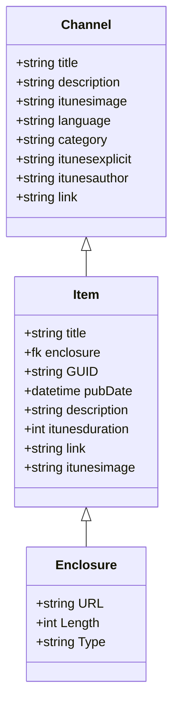

# PodDispenser: A Simple Podcast Host

PodDispenser is an opinionated podcast feed hosting platform built for Django 4.0
built to the Apple Podcast spec.

#### Apple Podcast RSS Spec

```mermaid
classDiagram
    Channel <|-- Item
    Item <|-- Enclosure
    
    Channel: +string title
    Channel: +string description
    Channel: +string itunesimage
    Channel: +string language
    Channel: +string category
    Channel: +string itunesexplicit
    Channel: +string itunesauthor
    Channel: +string link
    
    Item: +string title
    Item: +fk enclosure
    Item: +string GUID
    Item: +datetime pubDate
    Item: +string description
    Item: +int itunesduration
    Item: +string link
    Item: +string itunesimage

    Enclosure: +string URL
    Enclosure: +int Length
    Enclosure: +string Type
```
    